<!-- update with my linkedin account once created -->

## `Hi there, I'm Javi` 🖖🏼

Alumni of [Hive Helsinki](https://www.hive.fi/en/), part of the [42 Network](https://42.fr/en/network-42/) — where I wrote a considerable amount of **C** and got a serious introduction to full-stack web development. After that, I haven't stopped; just check my contribution grid to find out what I'm talking about 😎.

These days I build backends and LLM tooling, keep a soft spot for Unix internals, and spend my curiosity budget on math, algorithms, cryptography and cybersecurity. By day, I work at the movies.

 &nbsp;&nbsp; 

---

### What I build with

**Core**

**Services**

**Agents & LLMs**

`Also fluent in:` PHP, JavaScript, React, Azure, gRPC, Pydantic, asyncio, LangChain, CrewAI.

---

> *"Once men turned their thinking over to machines in the hope that this would set them free. But that only permitted other men with machines to enslave them."*
>
> — Frank Herbert, *Dune*
